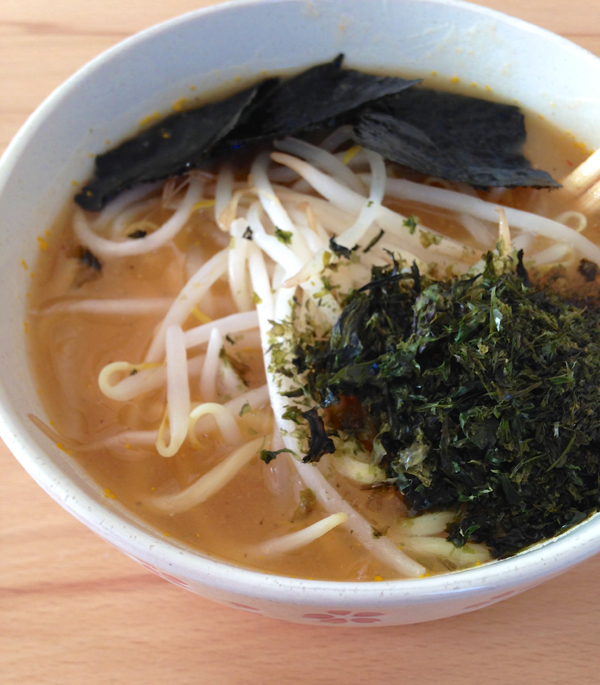

# どろり濃厚醤油ラーメン - DororichnessSoySouceRamen

## 材料

1人前

- 麺
  - 中華太麺　1玉
- 具 (お好みで)
  - もやし 1/2袋
  - ねぎ 適量
  - 焼き海苔
- かえし
  - うすくち醤油       大さじ1
  - 日本酒             大さじ1 + 小さじ1/2
  - 砂糖               大さじ1/2
  - 塩                 大さじ1/2
  - ナンプラー         小さじ1/2
  - 味の素             小さじ1/2
  - かつお風味だしの素 小さじ1/2
- スープ
  - 昨夜のしゃぶしゃぶ鍋の残り汁 500ml
  - 生姜               1欠片(適量)
  - じゃがいも         1個
  - 人参               1/4本
  - 鷹の目             1つ

## 作り方

### スープをつくる

1. じゃがいも、人参をぶつ切り、生姜と鷹の目を細かく刻んで残り汁に入れて沸騰させる。
2. じゃがいもと人参が柔らかくなるまで煮えたらミキサーで撹拌する。
3. ドロドロになればスープの完成。

### かえしをつくる

1. かえしの調味料を全部合わせて小鍋で弱火でアルコールを飛ばす。
2. アルコールがとんでちょっと煮詰まったら器にうつす。かえしの完成。

### 麺を茹でる

1. 中華太麺を茹でる。麺にもよるが湯で時間は5分ほど。
2. 茹でてから4分ほど経過したらもやしも茹でる。
3. 麺ともやしが茹で上がったら湯をよく切る。

### 盛り付ける

1. かえしの入った器にスープを注いでよく混ぜる。
2. 麺をスープの入った器にいれて麺をスープに馴染ませる。
3. もやしと焼き海苔を盛りつけて完成。

## ポイント

- スープは天下一品のラーメンくらいドロりとしてると美味しいです。
- スープが濃過ぎたら水を入れて調製すると良いです。
- かえしは煮立たせる時に焦げやすいので混ぜながら煮ると良いです。
